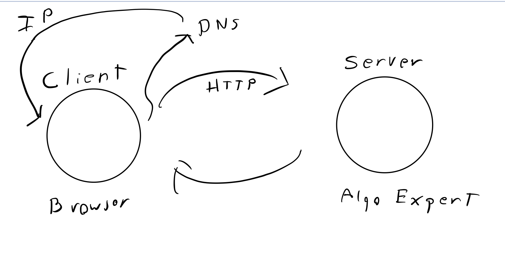
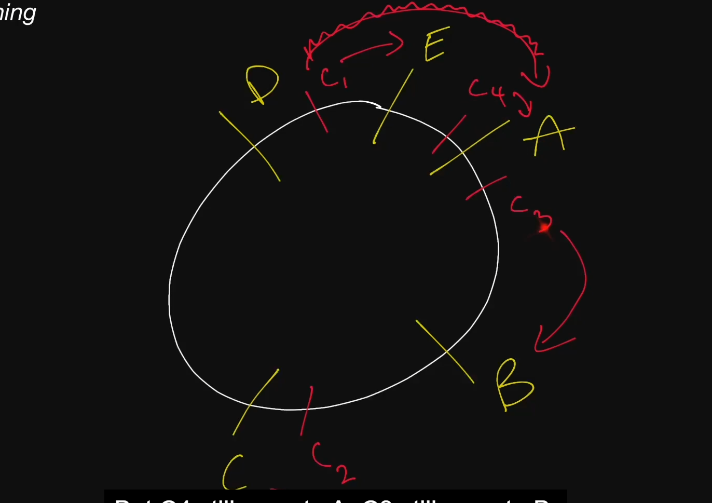

# Systems-Design-Fundamentals

## Intro

Naturally, SD interviews will be vague. It is important to investigate further into a question.

#### Categories

- Underlying/Foundational systems knowledge
- Key characteristics of systems - things that you might want the system to have - eg. redundancy, availability, etc
- Actual components - more tangible things, such as load balancer, caches, etc
- Tech - eg. redux, AWS, etc

## Client-Server Model

Notes: Like the foundation of the modern internet, how computers speak to one another

Client - Requests data to a server

Server - Listens to a client, and sends data

## Network Protocols

Notes: A protocol is just an agreed upon set of rules for an interaction between 2 parties.
Modern internet essentially runs following the IP.

The modern internet runs on IP. This means that when a machine or a client interacts with another machine, the data is sent in the from a an **IP packet**. IP packets have 2 main sections, the IP headers and the payload (data). 

A handshake is a special TCP interaction when a PC contacts another, saying "hey i wanna connect" and the other PC responds. After these the 2 machines are free to talk to another. TCP is a more powerful wrapper around the IP. It still lacks a more robust framework that devs can rely on.

HTTP build on top of TCP. it gives a higher level abstraction, the request/response pattern. 

Key Terms:

- **IP Address:** An address given to each machine connected to the public internet. IPv4 addresses consist of four numbers separated by dots: **a.b.c.d** where all four numbers are between 0 and 255. Special values include:
  - **127.0.0.1:** Your own local machine. Also referred to as localhost.
  - **192.168.x.y:** Your private network. For instance, your machine and all machines on your private network will usually have 192.168 prefix

- **IP - Internet Protocol:** . This network protocol outlines how almost
  all machine-to-machine communications should happen in the world. Other
  protocols like TCP, UDP, HTTP are built on top of IP.

- **TCP - Transmission Control Protocol:**
  Network protocol built on top of the Internet Protocol (IP). Allows for
  ordered, reliable data delivery between machines over the public internet by
  creating a connection

- **HTTP - HyperText Transfer Protocol:** is a very common network protocol implemented on top of TCP. Clients make HTTP requests, and servers respond with a response.
- **IP Packet:**
  Sometimes more broadly referred to as just a (network) packet, an IP
  packet is effectively the smallest unit used to describe data being sent over IP, aside from bytes. An IP packet consists of:
  - IP header, which contains the source and destination IP addresses as well as other information related to the network
  - Payload, which is just the data being sent over the network

## Storage

Notes: A data base is pretty much a server. A PC can be a DB is set up accordingly for clients. DB are persistent. If you write to Disk, data will persist. Data stored in memory is temporary. 

DB serve to store and retrieve data. DB persistent of data is not always guaranteed in the case of an issue like a power outage. If data is saved on Disk, then data will persist. In contrast, if DB writes data in memory, if DB server goes down, the data will not persist (An example of storing data in memory is like if you are storing data in a HashMap or Array). DB are a more complex topic than explained here. There is a lot of depth to them. There are multiple DB system that offer different structures. 

Key Terms:

- **Databases:** Databases are programs that either use disk or memory to do 2 core things: record data and query data. In general, they are themselves servers that are long lived and interact with the rest of your application through network calls, with protocols on top of TCP or even HTTP. Some databases only keep records in memory, and the users of such databases are aware of the fact that those records may be lost forever if the machine or process dies. For the most part though, databases need persistence of those records, and thus cannot use memory. This means that you have to write your data to disk. Anything written to disk will remain through power loss or network partitions, so that’s what is used to keep permanent records. Since machines die often in a large scale system, special disk partitions or volumes are used by the database processes, and those volumes can get recovered even if the machine were to go down permanently.

- **Disk:** Usually refers to either HDD (hard-disk drive) or SSD (solid-state drive). Data written to disk will persist through power failures and general machine crashes Disk is also referred to as nonvolatile storage. SSD is far faster than HDD (see latencies of accessing data from SSD and HDD) but also far more expensive from a financial point of view. Because of that, HDD will typically be used for data that's rarely accessed or updated, but that's stored for a long time, and SSD will be used for data that's frequently accessed and updated.

- **Memory:** Short for Random Access Memory (RAM). Data stored in memory will be lost when the process that has written that data dies.

- **Persistent Storage:** Usually refers to disk, but in general it is any form of storage that persists if the process in charge of managing it dies.

## Latency and Throughput

Notes: latency is how long it takes for data to get from one point in a system to another point. For example, a network request. The time it take to get to a server and back to the client.

Throughput How much work can a machine perform in a given amount of time. How much data can be handled/transferred in a given time.

Key terms:

- **Latency:** The time it takes for a certain operation to complete in a system. Most often this measure is a time duration, like milliseconds or seconds. You should know these orders of magnitude:

  - Reading 1 MB from RAM: 250 μs (0.25 ms)
  - Reading 1 MB from SSD: 1,000 μs (1 ms)
  - Transfer 1 MB over Network: 10,000 μs (10 ms)
  - Reading 1 MB from HDD: 20,000 μs (20 ms)
  - Inter-Continental Round Trip: 150,000 μs (150 ms)

- **Throughput:** The number of operations that a system can handle properly per time unit. For instance the throughput of a server can often be measured in requests per second (RPS or QPS).

## Availability

Notes: SLOs are what make up an SLA. Many products/services have SLAs available to be seen by customers. High availability is hard, and comes at cost. Typically comes with trade-offs.No all parts of a system need to be highly available.

How do you make a system highly available? make sure you system does not have single points of failure. To eliminate this we do redundancy - the act of replicating parts of a system. For example, we can have more than one server that access a Database with more than one load balancer to eliminate a single point of failure.

Passive redundancy - having multiple components at a given layer in a system, and if one of the components dies, nothing happens, the load is shared to the other components in the layer.

Active redundancy - when you have many machines working together, and the is only one machine handling traffic for example, and this machine fails, the other machines are going to know that it failed, and are going to take over. This approach is more complicated.

Key Terms:

- **Availability:** the odds of a particular server or service being up and running at any point in time, usually measured in percentages. A server that has 99% availability will be operational 99% of the time - this would be described as having two nines of availability

- **High Availability:** Used to describe systems that have particularly high levels of availability, typically 5 nines or more; sometimes abbreviated "HA".

- **Nines:** Typically refers to percentage of uptime. For example, 5 nines of availability means an uptime of 99.999% of the time. Below are the downtimes expected per year depending on those 9s:

  - 99% (two 9s): 87.7 hours
  - 99.9% (three 9s): 8.8 hours
  - 99.99%: 52.6 minutes
  - 99.999%: 5.3 minutes

- **Redundancy:** The process of replicating parts of a system in an effort to make it more reliable

- **SLA:** Short for "service-level agreement", an SLA is a collection of guarantees given to a customer by a service provider. SLAs typically make guarantees on a system's availability, amongst other things. SLAs are made up of one or multiple SLOs.

- **SLO:** Short for "service-level objective", an SLO is a guarantee given to a customer by a service provider. SLOs typically make guarantees on a system's availability, amongst other things. SLOs constitute an SLA.

## Caching

Notes: we typically use caching to speed up time complexity of an algorithm. In terms of a system, caching is used to improve the latency of a system, to speed up a system. CAching is going to be storing data, in a different location form the source of the data, where is faster to access it.

Instances where caching can be useful:

- If you are making many network requests
- If you are making long computational operations
- If you want to improve throughput, maybe you want to reduce the hits on a DB, and hit a cache instead

When it comes to writing to a cache there could be different scenarios:

1. Write through cache - a type of caching system when you edit a piece of data, your system will write that piece of data to the DB and to the cache on the same operation. This way the cache and the DB are always in sync, however this is more costly since you still have to hit the DB

2. Write back cache - the server will only update the cache, so it will be out of sync with DB, then the system will asynchronous update the DB (every 5min, or every so often). One of the downsides is that if the cache is lost, then you lose data.

For example, if designing the youtube comment section, then possibly having a stale comment being seen, or e1240en being replied to is bad. Therefore a solution like Write back Caching would not be ideal and a write through caching would be better or having an isolated instance of a cache could also be ideal, e.g. a redis instance.

In general, if the data that you are dealing with is static data the caching is great, but if the data is mutable, then it can get tricky. Then you would need to keep the sources of truth in sync.

Def consider using caching if the data is static, if you have a single point reading or writing the data, if you don't care about consistency/staleness.

Eviction policies with caching:

- LRU: You get rid of the least recently used data
- LFU: Ypu get rid of the least frequently used data

Key terms:

- **Cache:** A piece of hardware or software that stores data, typically meant to retrieve that data faster than otherwise. Caches are often used to store responses to network requests as well as results of computationally-long operations. Note that data in a cache can become stale if the main source of truth for that data (i.e., the main database behind the cache) gets updated and the cache doesn't.

- **Cache Hit:** When requested data is found in a cache

- **Cache Miss:** When requested data could have been found in a cache but isn't. This is typically used to refer to a negative consequence of a system failure or of a poor design choice. For example: If a server goes down, our load balancer will have to forward requests to a new server, which will result in cache misses

- **Cache Eviction Policy:** The policy by which values get evicted or removed from a cache. Popular cache eviction policies include LRU (least-recently used), FIFO (first in first out), and LFU (least-frequently used).

- **Content Delivery Network:** A CDN is a third-party service that acts like a cache for your servers. Sometimes, web applications can be slow for users in a particular region if your servers are located only in another region. A CDN has servers all around the world, meaning that the latency to a CDN's servers will almost always be far better than the latency to your servers. A CDN's servers are often referred to as PoPs (Points of Presence). Two of the most popular CDNs are Cloudflare and Google Cloud CDN

## Proxies

**Notes:** There are forward and reverse proxies. A forward proxy is a server that sits between a client(s) and a server(s). It is a server that acts on behalf of the client. Proxies are on the clients team of an interaction with a server. When the client is going to issues a request, it first goes to the proxy first, and then the proxy will forward the request to the server. Then the server responds, it the response also goes trough the proxy. A proxy can serve as way to hide the identity of a client. The source IP address from the initial request can be removed and replaced by going through a proxy. This is similar to the behavior of a **VPN**. 

Reverse proxies act on behalf of the server. If a client wants to send a request to a server, the request is actually going to go to the reverse proxy first. The client would be unaware of this. The Reverse proxy will forward the request to the server. Reverse proxies are very useful. For instance, you can filter out request that you want to ignore. You can have the reverse proxy take care of caching or logging. One of the use cases is to use a reverse proxy as a **load balancer**. 

Key Terms:

- **Forward Proxy:** A server that sits between a client and servers and act on behalf of the client, typically used to mask the client's identity (IP address). Note that forward proxies are often referred to as just proxies.

- **Reverse Proxy:** A server that sits between clients and servers and act on behalf of the servers, typically used for logging, load balancing, or caching.

- **Nginx:** Pronounced "engine X" - is a very popular webserver that's often used as a reverse proxy and load balancer. 

## Load Balancers

**Notes:** Very common, used when servers have to manage a limited amount of resources. When a system is horizontally scaled system, meaning that there are multiple servers to manage the request from the clients, a load balancer can be used to know to what server issue the requests to. A load balancer is a server that sits in between a set of clients and a set of servers, it has the job of balancing workloads across resources. The clients issue the request to the load balancer, and then the load balancer redirect the request to the proper server. Load balancers assist with preventing servers overloading with an excess of requests. And also by distributing better the request, the system provides a better throughput. Load balancers are a type of reverse proxy. They can happen at multiple places in a system.  

One way that load balancers select servers is a round robin approach. It is a method that it goes trough all the servers in an order, and then it repeats, like a circle. Another more complex approach is a weighted round robin, you assign a weight on a server. This can mean that the load balancer can redirect more request to a server than another. This could be could be because one server could be more powerful than another. Another way os based on performance. The load balancer would perform health checks on the servers, and based on the info it decides where to redirect requests. Another common is an IP based server selection strategy. When Load balancer receives a request, it hashes the IP address of the client to send request to mapped server. Another strategy is a path based server selection, a load balancer distributes request depending on the path. For example, all request related to payments go to a specific set of servers, or all request related to advertising get routed to a specific set of servers. 

Sometimes it can make sense to have multiple load balancers with different strategies. For example, clients can issue request to a first load balancer, and then these are redirected to other load balancers with a different strategy. 

**Key Terms:**

- **Load Balancers:** A type of reverse proxy that distributes traffic across servers. Load balancers can be found in many parts ofa system, from the DNS layer all the way to the database layer. 

- **Server-Selection Strategy:** How a load balancer chooses servers when distributing traffic amongst multiple servers. Commonly used strategies include round-robin, random selection, performance-based selection (choosing the server with the best performance metrics, like the fastest response time or the least amount of traffic), and IP-based Routing.

- **Hot Spot:** When distributing a workload across a set of servers, that workload might be spread unevenly. This can happen if your sharding key or your hashing function are suboptimal, or if your workload is naturally skewed: some servers will receive a lot more traffic than others, this creating a "hot spot".

## Hashing

**Key Terms**

- **Hashing Function:** A function that takes in a specific data type (such as a string or an identifier) and outputs a number. Different inputs may have the same output, but a good hashing function attempts to minimize those **hashing collisions** (which is equivalent to maximizing uniformity).

- **Consistent Hashing:** A type of hashing that minimizes the number of keys that need to be remapped when a hash table gets resized. It's often used by load balancers to distribute traffic to servers; it minimizes the number of requests that get forwarded to different servers when new servers are added or when existing servers are brought down.

- **Rendezvous Hashing:** A type of hashing also coined highest random weight hashing. Allows for minimal re-distribution of mappings when a server goes down.

- **SHA:** Short for "secure hash algorithm", the SHA is a collection fo cryptographic hash functions used in the industry. These days, SHA-3 is a popular choice to use in a system.

Notes:

Hashing is an action that you can perform to transform an arbitrary piece of data into a fixed size value, typically an integer value. For example when a group of clients hits a load balancer proxy server, we can hash the request that come in, and bucket the request to be routed to a specific server. One simple way to hash is to mod the some integer representation of the request by the number of servers. 

Hashing functions should have uniformity, evenly distributing the data values. Typically we do not write our own hashing functions. We use already created and popular hashing functions. When you are dealing with a large scale system, things get more complicated, things like server dying can happen, new servers come in, or server can get busier than others. 

For consistent hashing, you can thin about it non-linearly, where servers are positioned on a circle, requests move clockwise or counter-clockwise to get mapped to the first server they encounter.  

## Glossary

- **Client:**
  A machine or process that requests data or service from a server.
  Note that a single machine or piece of software can be both a client and a
  server at the same time. For instance, a single machine could act as a server
  for end users and as a client for a database.
- **Server:**
  A machine or process that provides data or service for a client, usually by
  listening for incoming network calls.
- **IP Address:**
  An address given to each machine connected to the public internet. IPv4
  addresses consist of four numbers separated by dots: **a.b.c.d** where all
  four numbers are between 0 and 255.
